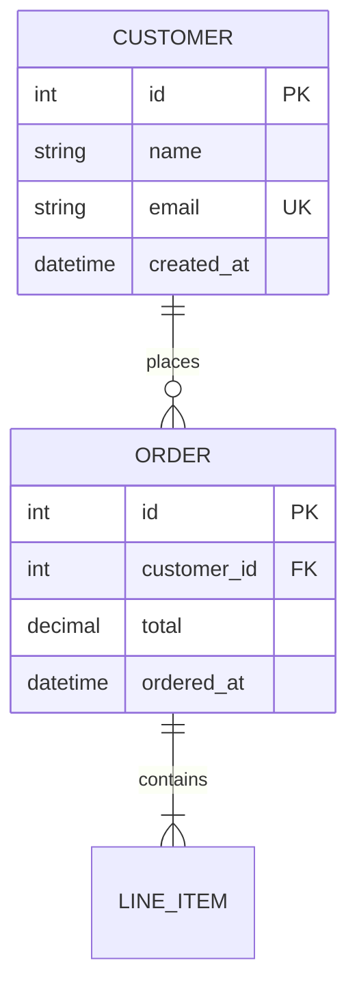

# Entity Relationship Diagram (ERD) Visualization

## Overview

The ERD panel provides interactive visualization of database schemas with multiple rendering options. It automatically parses Laravel migrations, Rails schema.rb files, and Mermaid ERD syntax to render explorable entity-relationship diagrams.

## Accessing the ERD Panel

1. Open a repository in Ledger
2. In the Viz column, click the panel selector (dropdown at top)
3. Select **ERD** (◫ icon)

The panel will automatically detect your framework and parse the schema.

## Supported Frameworks

| Framework | Detection | Schema Sources |
|-----------|-----------|----------------|
| **Laravel** | `artisan` file present | `database/migrations/*.php`, `app/Models/*.php` |
| **Rails** | `Rakefile` + `config/application.rb` | `db/schema.rb`, `app/models/*.rb` |
| **Generic** | Fallback | `.mmd`, `.mermaid`, `.erd.md` files with Mermaid ERD syntax |

| Renderer | Icon | Description |
|----------|------|-------------|
| **Canvas** | ◫ | tldraw infinite canvas - freeform exploration with pan/zoom/draw |
| **Graph** | ◉ | React Flow node graph - structured editing with minimap |
| **JSON** | { } | Raw data inspector - expandable tree view for debugging |

### Canvas (tldraw)

Best for: Freeform exploration, adding annotations, taking screenshots

- **Pan**: Click and drag on empty canvas
- **Zoom**: Scroll wheel or pinch gesture
- **Select**: Click on entities
- **Move**: Drag entities to reposition
- **Multi-select**: Shift+click or drag selection box
- **Draw**: Full tldraw toolbar for annotations

### Graph (React Flow)

Best for: Structured viewing, clean exports, large schemas

- **Pan**: Click and drag on background
- **Zoom**: Scroll wheel or pinch gesture
- **Move**: Drag entities to reposition
- **MiniMap**: Navigate large schemas via corner preview
- **Controls**: Zoom buttons in bottom-left

### JSON (Data Inspector)

Best for: Debugging, inspecting parsed data, copying schema

- **Expand/Collapse**: Click arrows to navigate tree
- **Copy**: Button to copy full JSON to clipboard
- **Entity Names**: Collapsed nodes show entity/relationship names

## Header Bar

- **Framework Badge**: Shows detected framework (🐘 Laravel / 💎 Rails)
- **Entity Count**: Number of tables and relationships displayed
- **Renderer Toggle**: Switch between Canvas / Graph / JSON views
- **Refresh** (↻): Re-parse schema from source files

## Entity Display

Each table/entity displays:

| Element | Description |
|---------|-------------|
| **Header** | Table name (highlighted accent color) |
| **🔑** | Primary key column |
| **🔗** | Foreign key column |
| **✦** | Unique constraint |
| **⚡** | Indexed column |
| *Italic name* | Nullable column |

## Relationships

Arrows/edges connect related entities:

- **One-to-One**: Single arrow
- **One-to-Many**: Arrow with label
- **Many-to-Many**: Bidirectional indicators

## Smart Filtering

On initial load, the ERD filters to show only "hub" entities—tables with 3+ relationships to other hub entities. This reduces visual noise in large schemas. Click **Refresh** to re-apply this filter after manual changes.

## Data Types

The parser recognizes common column types and displays them in abbreviated form:

| Laravel | Rails | Display |
|---------|-------|---------|
| `$table->id()` | `t.primary_key` | `bigint` (PK) |
| `$table->foreignId()` | `t.references` | `bigint` (FK) |
| `$table->string()` | `t.string` | `string` |
| `$table->text()` | `t.text` | `text` |
| `$table->timestamps()` | `t.timestamps` | `created_at`, `updated_at` |
| `$table->boolean()` | `t.boolean` | `bool` |
| `$table->json()` | `t.json` | `json` |

## Architecture

See [Renderer Architecture](./renderer-architecture.md) for details on the multi-renderer pattern.

```
┌─────────────────────────────────────────────────────────┐
│                    Schema Sources                        │
├──────────────────────────┬──────────────────────────────┤
│  Laravel                 │  Rails                       │
│  └─ database/migrations/ │  └─ db/schema.rb             │
│  └─ app/Models/          │  └─ app/models/              │
└──────────────────────────┴──────────────────────────────┘
                           │
                           ▼
┌─────────────────────────────────────────────────────────┐
│              ERD Parser Service (Main Process)           │
│  lib/services/erd/erd-parser-service.ts                 │
│  ├─ detectFramework(repoPath)                           │
│  ├─ parseSchema(repoPath) → ERDSchema                   │
│  └─ parseMermaidERD(content) → ERDSchema                │
└─────────────────────────────────────────────────────────┘
                           │ IPC
                           ▼
┌─────────────────────────────────────────────────────────┐
│              ERD Canvas Panel (Renderer)                 │
│  app/components/panels/viz/erd/                         │
│  ├─ ERDCanvasPanel.tsx    - Panel + renderer selector   │
│  ├─ layout/erd-layout.ts  - Shared Dagre layout         │
│  └─ renderers/                                          │
│      ├─ TldrawRenderer    - Infinite canvas             │
│      ├─ ReactFlowRenderer - Node graph                  │
│      └─ JsonRenderer      - Data inspector              │
└─────────────────────────────────────────────────────────┘
```

## IPC API

Available via `window.electronAPI`:

```typescript
// Get parsed ERD schema for current or specified repo
getERDSchema(repoPath?: string): Promise<ERDParseResult>

// Detect framework type without full parsing
detectERDFramework(repoPath?: string): Promise<ERDFrameworkResult>

// Parse Mermaid ERD content directly
parseMermaidERD(content: string): Promise<ERDParseResult>
```

## Mermaid ERD Support

You can create a `.mmd` or `.mermaid` file in your repo with Mermaid ERD syntax:



## Dependencies

- **tldraw** `^4.2.3` - Infinite canvas SDK (Canvas renderer)
- **@xyflow/react** `^12.x` - Node-based UI library (Graph renderer)
- **react-json-view-lite** `^2.x` - JSON tree viewer (JSON renderer)
- **dagre** `^0.8.5` - Directed graph layout algorithm

## Theming

All renderers respect Ledger's theme (light/dark mode). CSS variables from `app/styles/app.css` are used for consistent appearance across renderers.
