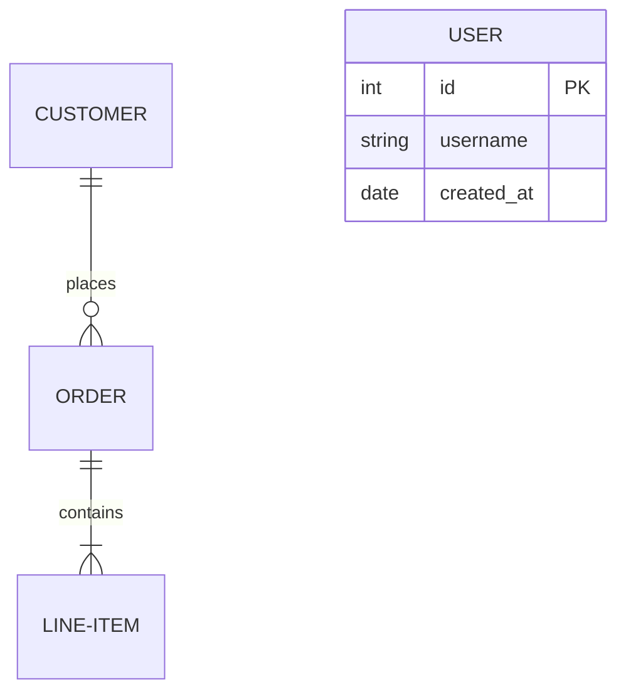

# ERD Infinite Canvas - Implementation Plan

## Overview

Add an Entity Relationship Diagram (ERD) visualization panel to Ledger using the **tldraw React SDK** for infinite canvas capabilities. This feature will parse Laravel and Rails schemas and render them as explorable, interactive diagrams.

## Research Summary

### tldraw SDK
- **Library**: [tldraw](https://tldraw.dev/) - MIT-licensed infinite canvas SDK for React
- **Version**: 4.0+ (SDK 4.0 released in 2025)
- **Key Features**:
  - Infinite pan/zoom canvas with built-in performance optimization
  - Custom shapes via `ShapeUtil` classes
  - Programmatic shape creation via `editor.createShapes()`
  - Full React integration
  - No watermark required for open source projects (MIT compatible)
- **Installation**: `npm install tldraw`

### Laravel ERD Sources
| Tool | Source | Output |
|------|--------|--------|
| [beyondcode/laravel-er-diagram-generator](https://github.com/beyondcode/laravel-er-diagram-generator) | Eloquent models | GraphViz/PNG |
| [kevincobain2000/laravel-erd](https://github.com/kevincobain2000/laravel-erd) | Model relationships | Interactive HTML |
| [laravel2erd](https://github.com/Priom7/laravel2erd) | Model parsing | Mermaid.js |

### Rails ERD Sources
| Tool | Source | Output |
|------|--------|--------|
| [voormedia/rails-erd](https://github.com/voormedia/rails-erd) | ActiveRecord models | GraphViz/PDF |
| [amatsuda/erd](https://github.com/amatsuda/erd) | DB schema + models | Interactive web |

### Mermaid ERD Syntax (for parsing)


---

## Architecture

### Data Flow

```
┌─────────────────────────────────────────────────────────────────────┐
│                         Schema Sources                               │
├─────────────────────────────────────────────────────────────────────┤
│  Laravel                           │  Rails                          │
│  ├─ database/migrations/*.php      │  ├─ db/schema.rb               │
│  ├─ app/Models/*.php               │  ├─ app/models/*.rb            │
│  └─ schema via artisan             │  └─ db/structure.sql           │
└──────────────────┬─────────────────┴────────────────┬───────────────┘
                   │                                   │
                   ▼                                   ▼
┌─────────────────────────────────────────────────────────────────────┐
│                    ERD Parser Service (Main Process)                 │
│  lib/main/erd-parser-service.ts                                     │
│  ├─ parseLaravelSchema(repoPath) → ERDSchema                        │
│  ├─ parseRailsSchema(repoPath) → ERDSchema                          │
│  ├─ parseMermaidERD(content) → ERDSchema                            │
│  └─ detectFramework(repoPath) → 'laravel' | 'rails' | 'unknown'    │
└──────────────────────────────────┬──────────────────────────────────┘
                                   │ IPC: 'get-erd-schema'
                                   ▼
┌─────────────────────────────────────────────────────────────────────┐
│                    ERD Canvas Panel (Renderer)                       │
│  app/components/panels/viz/ERDCanvasPanel.tsx                       │
│  ├─ <Tldraw shapeUtils={[EntityShapeUtil, RelationshipShapeUtil]}> │
│  ├─ Auto-layout algorithm (Dagre or custom)                         │
│  └─ Crow's foot notation for cardinality                            │
└─────────────────────────────────────────────────────────────────────┘
```

### Core Data Structures

```typescript
// lib/main/erd-types.ts

interface ERDSchema {
  entities: ERDEntity[]
  relationships: ERDRelationship[]
  framework: 'laravel' | 'rails' | 'generic'
  source: string  // file path or 'mermaid'
}

interface ERDEntity {
  id: string                    // Unique identifier
  name: string                  // Table/model name
  displayName: string           // Human-readable name
  attributes: ERDAttribute[]
  position?: { x: number; y: number }  // Optional saved position
}

interface ERDAttribute {
  name: string
  type: string                  // int, string, text, datetime, etc.
  constraints: ERDConstraint[]  // PK, FK, UK, nullable, etc.
  foreignKey?: {
    table: string
    column: string
  }
}

type ERDConstraint = 'PK' | 'FK' | 'UK' | 'nullable' | 'indexed'

interface ERDRelationship {
  id: string
  from: {
    entity: string              // Entity ID
    cardinality: ERDCardinality
  }
  to: {
    entity: string
    cardinality: ERDCardinality
  }
  label?: string                // Relationship name (e.g., "places")
  type: 'identifying' | 'non-identifying'
}

type ERDCardinality = 'one' | 'zero-or-one' | 'many' | 'one-or-more'
```

---

## Implementation Phases

### Phase 1: Foundation (Core Infrastructure)

#### 1.1 Install tldraw
```bash
npm install tldraw
```

#### 1.2 Create ERD Type Definitions
**File**: `lib/main/erd-types.ts`
- Define `ERDSchema`, `ERDEntity`, `ERDRelationship`, `ERDAttribute`
- Export types for both main and renderer processes

#### 1.3 Create Basic ERD Canvas Panel
**File**: `app/components/panels/viz/ERDCanvasPanel.tsx`
```typescript
import { Tldraw } from 'tldraw'
import 'tldraw/tldraw.css'

export function ERDCanvasPanel() {
  return (
    <div className="erd-canvas-container">
      <Tldraw />
    </div>
  )
}
```

#### 1.4 Register Panel in Canvas System
**Files to modify**:
- `app/types/app-types.ts` - Add `'erd-canvas'` to `VizPanelType`
- `app/components/canvas/CanvasRenderer.tsx` - Add rendering case
- `app/components/canvas/CanvasContext.tsx` - Add to FOCUS canvas preset

---

### Phase 2: Custom Shapes

#### 2.1 Entity Shape (Table Box)
**File**: `app/components/panels/viz/erd/EntityShapeUtil.tsx`

```typescript
import { ShapeUtil, HTMLContainer, Rectangle2d } from 'tldraw'

// Shape props
interface EntityShapeProps {
  w: number
  h: number
  entity: ERDEntity
}

declare module 'tldraw' {
  interface TLGlobalShapePropsMap {
    'erd-entity': EntityShapeProps
  }
}

export class EntityShapeUtil extends ShapeUtil<TLShape<'erd-entity'>> {
  static override type = 'erd-entity' as const

  getDefaultProps(): EntityShapeProps {
    return {
      w: 200,
      h: 150,
      entity: { id: '', name: '', displayName: '', attributes: [] }
    }
  }

  getGeometry(shape) {
    return new Rectangle2d({
      width: shape.props.w,
      height: shape.props.h,
      isFilled: true,
    })
  }

  component(shape) {
    const { entity } = shape.props
    return (
      <HTMLContainer className="erd-entity-shape">
        <div className="erd-entity-header">{entity.displayName}</div>
        <div className="erd-entity-attributes">
          {entity.attributes.map(attr => (
            <div key={attr.name} className="erd-attribute">
              <span className="erd-attr-key">
                {attr.constraints.includes('PK') && '🔑'}
                {attr.constraints.includes('FK') && '🔗'}
              </span>
              <span className="erd-attr-name">{attr.name}</span>
              <span className="erd-attr-type">{attr.type}</span>
            </div>
          ))}
        </div>
      </HTMLContainer>
    )
  }

  indicator(shape) {
    return <rect width={shape.props.w} height={shape.props.h} />
  }
}
```

#### 2.2 Relationship Shape (Connector Line)
**File**: `app/components/panels/viz/erd/RelationshipShapeUtil.tsx`

Custom arrow shape with crow's foot notation endpoints:
- `||` = exactly one
- `o|` = zero or one
- `|{` = one or more
- `o{` = zero or more

#### 2.3 Shape Styles
**File**: `app/styles/erd-canvas.css`
```css
.erd-entity-shape {
  background: var(--bg-secondary);
  border: 1px solid var(--border-primary);
  border-radius: 4px;
  font-family: var(--font-mono);
  font-size: 12px;
}

.erd-entity-header {
  background: var(--accent-primary);
  color: var(--text-inverse);
  padding: 8px;
  font-weight: 600;
}

.erd-attribute {
  display: flex;
  padding: 4px 8px;
  border-bottom: 1px solid var(--border-secondary);
}

.erd-attr-key { width: 24px; }
.erd-attr-name { flex: 1; }
.erd-attr-type { color: var(--text-secondary); }
```

---

### Phase 3: Schema Parsers

#### 3.1 Parser Service
**File**: `lib/main/erd-parser-service.ts`

```typescript
export class ERDParserService {
  async parseSchema(repoPath: string): Promise<ERDSchema> {
    const framework = await this.detectFramework(repoPath)

    switch (framework) {
      case 'laravel':
        return this.parseLaravelSchema(repoPath)
      case 'rails':
        return this.parseRailsSchema(repoPath)
      default:
        throw new Error('Unknown framework')
    }
  }

  private async detectFramework(repoPath: string): Promise<string> {
    // Check for artisan (Laravel)
    if (await fileExists(path.join(repoPath, 'artisan'))) {
      return 'laravel'
    }
    // Check for Rakefile (Rails)
    if (await fileExists(path.join(repoPath, 'Rakefile'))) {
      return 'rails'
    }
    return 'unknown'
  }
}
```

#### 3.2 Laravel Parser
Parse from multiple sources (priority order):
1. **Migrations**: `database/migrations/*.php` - Parse `Schema::create()` calls
2. **Models**: `app/Models/*.php` - Parse `$fillable`, relationships
3. **Mermaid file**: Check for existing `.erd.mmd` files

```typescript
private async parseLaravelSchema(repoPath: string): Promise<ERDSchema> {
  const migrationsPath = path.join(repoPath, 'database/migrations')
  const migrations = await glob('*.php', { cwd: migrationsPath })

  const entities: ERDEntity[] = []
  const relationships: ERDRelationship[] = []

  for (const migration of migrations) {
    const content = await fs.readFile(path.join(migrationsPath, migration), 'utf-8')

    // Parse Schema::create('table_name', function (Blueprint $table) { ... })
    const createMatches = content.matchAll(
      /Schema::create\(['"](\w+)['"],.*?function.*?\{([\s\S]*?)\}\);/g
    )

    for (const match of createMatches) {
      const tableName = match[1]
      const tableBody = match[2]
      const attributes = this.parseLaravelColumns(tableBody)

      entities.push({
        id: tableName,
        name: tableName,
        displayName: this.toTitleCase(tableName),
        attributes
      })
    }
  }

  // Parse relationships from models
  const modelsPath = path.join(repoPath, 'app/Models')
  // ... parse hasMany, belongsTo, etc.

  return { entities, relationships, framework: 'laravel', source: repoPath }
}
```

#### 3.3 Rails Parser
Parse from:
1. **schema.rb**: `db/schema.rb` - Definitive schema source
2. **Models**: `app/models/*.rb` - Parse `has_many`, `belongs_to`, etc.

```typescript
private async parseRailsSchema(repoPath: string): Promise<ERDSchema> {
  const schemaPath = path.join(repoPath, 'db/schema.rb')
  const content = await fs.readFile(schemaPath, 'utf-8')

  const entities: ERDEntity[] = []

  // Parse create_table blocks
  const tableMatches = content.matchAll(
    /create_table\s+"(\w+)".*?do\s+\|t\|([\s\S]*?)end/g
  )

  for (const match of tableMatches) {
    const tableName = match[1]
    const tableBody = match[2]
    const attributes = this.parseRailsColumns(tableBody)

    entities.push({
      id: tableName,
      name: tableName,
      displayName: this.toTitleCase(tableName),
      attributes
    })
  }

  return { entities, relationships: [], framework: 'rails', source: schemaPath }
}
```

#### 3.4 Mermaid Parser (Bonus)
Support importing existing Mermaid ERD files:
```typescript
parseMermaidERD(content: string): ERDSchema {
  // Parse erDiagram blocks
  // Extract entities with attributes
  // Extract relationships with cardinality
}
```

---

### Phase 4: IPC Integration

#### 4.1 IPC Handlers
**File**: `lib/main/main.ts` (add handlers)

```typescript
import { ERDParserService } from './erd-parser-service'

const erdParserService = new ERDParserService()

ipcMain.handle('get-erd-schema', async (_event, repoPath: string) => {
  try {
    const schema = await erdParserService.parseSchema(repoPath)
    return { success: true, data: schema }
  } catch (error) {
    return { success: false, message: error.message }
  }
})

ipcMain.handle('detect-erd-framework', async (_event, repoPath: string) => {
  try {
    const framework = await erdParserService.detectFramework(repoPath)
    return { success: true, data: framework }
  } catch (error) {
    return { success: false, message: error.message }
  }
})
```

#### 4.2 Preload Exposure
**File**: `lib/preload/preload.ts`
```typescript
getERDSchema: (repoPath: string) => ipcRenderer.invoke('get-erd-schema', repoPath),
detectERDFramework: (repoPath: string) => ipcRenderer.invoke('detect-erd-framework', repoPath),
```

#### 4.3 Type Declarations
**File**: `app/types/electron.d.ts`
```typescript
getERDSchema: (repoPath: string) => Promise<{ success: boolean; data?: ERDSchema; message?: string }>
detectERDFramework: (repoPath: string) => Promise<{ success: boolean; data?: string; message?: string }>
```

---

### Phase 5: Auto-Layout

#### 5.1 Layout Algorithm Options

**Option A: Dagre (Recommended)**
```bash
npm install dagre @types/dagre
```

Dagre is a JavaScript library for directed graph layout, perfect for ERD:
```typescript
import dagre from 'dagre'

function layoutERD(schema: ERDSchema): Map<string, { x: number; y: number }> {
  const g = new dagre.graphlib.Graph()
  g.setGraph({ rankdir: 'TB', nodesep: 50, ranksep: 100 })
  g.setDefaultEdgeLabel(() => ({}))

  // Add nodes
  schema.entities.forEach(entity => {
    const height = 40 + entity.attributes.length * 24
    g.setNode(entity.id, { width: 200, height })
  })

  // Add edges
  schema.relationships.forEach(rel => {
    g.setEdge(rel.from.entity, rel.to.entity)
  })

  dagre.layout(g)

  const positions = new Map()
  g.nodes().forEach(id => {
    const node = g.node(id)
    positions.set(id, { x: node.x, y: node.y })
  })

  return positions
}
```

**Option B: Force-Directed (d3-force)**
Better for organic layouts but less predictable.

**Option C: Manual + Persistence**
Let users drag entities, save positions to `erd-positions.json`.

#### 5.2 Integration with tldraw
```typescript
function renderERDOnCanvas(editor: Editor, schema: ERDSchema) {
  const positions = layoutERD(schema)

  const shapes = schema.entities.map(entity => {
    const pos = positions.get(entity.id)!
    return {
      type: 'erd-entity',
      x: pos.x,
      y: pos.y,
      props: {
        w: 200,
        h: 40 + entity.attributes.length * 24,
        entity
      }
    }
  })

  editor.createShapes(shapes)

  // Create relationship arrows
  // ... using tldraw's built-in arrow shape or custom
}
```

---

### Phase 6: UI Polish

#### 6.1 Panel Controls
- Framework detection badge (Laravel/Rails)
- Refresh button to re-parse schema
- Layout algorithm selector (Dagre/Force/Manual)
- Export options (PNG, SVG, Mermaid)
- Search/filter entities

#### 6.2 Interactivity
- Click entity to see full details in editor panel
- Hover relationship to highlight connected entities
- Double-click to focus/zoom on entity
- Context menu for entity operations

#### 6.3 Persistence
- Save entity positions per repo
- Remember zoom/pan state
- Export/import ERD as JSON

---

## File Structure (Final)

```
app/
├── components/panels/viz/
│   ├── ERDCanvasPanel.tsx         # Main panel component
│   └── erd/
│       ├── EntityShapeUtil.tsx    # Entity (table) custom shape
│       ├── RelationshipShapeUtil.tsx  # Connector custom shape
│       ├── ERDControls.tsx        # Panel header controls
│       └── erdLayout.ts           # Dagre layout algorithm
├── styles/
│   └── erd-canvas.css             # ERD-specific styles
└── types/
    └── erd-types.ts               # Shared ERD types (renderer)

lib/
├── main/
│   ├── erd-parser-service.ts      # Schema parsing logic
│   ├── erd-types.ts               # Shared ERD types (main)
│   └── main.ts                    # IPC handlers (modified)
└── preload/
    └── preload.ts                 # Expose ERD APIs (modified)
```

---

## Dependencies to Add

```json
{
  "dependencies": {
    "tldraw": "^4.0.0",
    "dagre": "^0.8.5"
  },
  "devDependencies": {
    "@types/dagre": "^0.7.52"
  }
}
```

---

## Risks & Mitigations

| Risk | Impact | Mitigation |
|------|--------|------------|
| tldraw bundle size (~500KB) | Larger app | Code-split, lazy load panel |
| Schema parsing edge cases | Incorrect ERD | Start with common patterns, iterate |
| Performance with 100+ entities | Slow rendering | tldraw handles this well; add virtualization if needed |
| Electron + tldraw compatibility | Runtime errors | Test early in Phase 1 |

---

## Success Criteria

1. **Phase 1**: Empty tldraw canvas renders in viz column
2. **Phase 2**: Custom entity shapes display correctly
3. **Phase 3**: Laravel schema.rb parses to ERDSchema
4. **Phase 4**: Full round-trip: repo path → parsed schema → rendered ERD
5. **Phase 5**: Auto-layout produces readable diagrams
6. **Phase 6**: Production-ready UX with controls and persistence

---

## References

### tldraw
- [tldraw.dev](https://tldraw.dev/) - Official documentation
- [Quick Start](https://tldraw.dev/quick-start) - Getting started
- [Custom Shapes](https://tldraw.dev/docs/shapes) - ShapeUtil documentation
- [GitHub](https://github.com/tldraw/tldraw) - Source code and examples

### Laravel ERD
- [beyondcode/laravel-er-diagram-generator](https://github.com/beyondcode/laravel-er-diagram-generator)
- [laravel2erd](https://github.com/Priom7/laravel2erd) - Mermaid-based

### Rails ERD
- [voormedia/rails-erd](https://github.com/voormedia/rails-erd) - ActiveRecord ERD
- [amatsuda/erd](https://github.com/amatsuda/erd) - Interactive Rails engine

### Mermaid ERD
- [Mermaid ERD Syntax](https://mermaid.js.org/syntax/entityRelationshipDiagram.html)

### Layout
- [Dagre](https://github.com/dagrejs/dagre) - Directed graph layout
